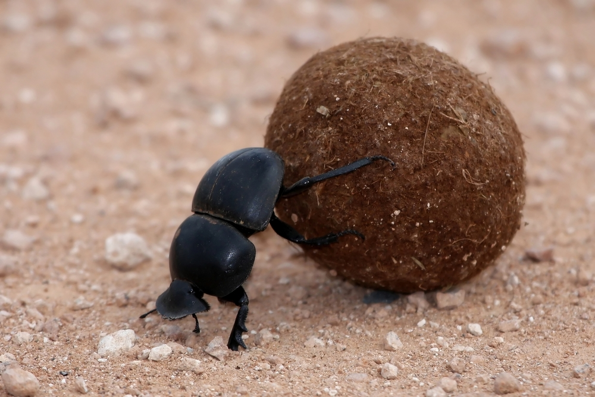

Welcome to scaraplate's documentation!
======================================

:Documentation: https://scaraplate.readthedocs.io/
:Source Code: https://github.com/rambler-digital-solutions/scaraplate
:Issue Tracker: https://github.com/rambler-digital-solutions/scaraplate/issues
:PyPI: https://pypi.org/project/scaraplate/

.. TODO add logo

Introduction
------------

Scaraplate is a wrapper around :doc:`cookiecutter <cookiecutter_rtd:readme>`
which allows to repeatedly rollup project templates onto concrete projects.

Cookiecutter is a great tool which allows to create projects from templates.
However, it lacks ability to update the already created projects from updated
templates. Scaraplate provides a solution to this problem.

To use scaraplate, you would have to add a ``scaraplate.yaml`` file near
the ``cookiecutter.json`` of your :doc:`cookiecutter template <cookiecutter_rtd:overview>`.
Then, to rollup the changes from the updated template, you will need
to simply call this command (which can even be automated!):

::

    scaraplate rollup ./path/to/template ./path/to/project --no-input

This allows to easily (and automatically) sync the projects from the template,
greatly simplifying the unification of the projects' structure.

CI pipelines, code linting settings, test runners, directory structures,
artifacts building tend to greatly vary between the projects.
Once described in the template which is easy to rollup onto the specific
projects, projects unification becomes a trivial task.  Everything can be
defined in the template just once and then regularly be synced onto your
projects, see :doc:`automation`.

.. _how_it_works:

How it works
------------

The ``scaraplate rollup`` command does the following:

1. Retrieve cookiecutter template variables from the previous rollup
   (see :doc:`template`).
2. Create a temporary dir, apply `cookiecutter` command with the retrieved
   variables to create a new temporary project.
3. For each file in the temporary project, apply a `strategy`
   (see :doc:`strategies`) which merges the file from the temporary project
   with the corresponding file in the target project.

Only the files which exist in the temporary project are touched by
scaraplate in the target project.

The key component of scaraplate are the `strategies`.

Note that none of the strategies use git history or any git-like
merging. In fact, scaraplate makes no assumptions about the code
versioning system used by the target project.
Instead, the merging between the files is defined solely by `strategies`
which generate the output based on the two files and the settings in
the ``scaraplate.yaml``.

Quickstart
----------

`scaraplate` requires Python 3.6 or newer.

Installation:

::

    pip install scaraplate

Scaraplate also requires ``git`` to be installed in the system
(see :doc:`template`).

To get started with scaraplate, you need to:

1. Prepare a template (see :doc:`template` and specifically
   :ref:`scaraplate_example_template`).
2. Roll it up on your projects.

Project Name
------------

The project name is inspired by a bug which rolls up the brown balls
of ... well, stuff, (the template) everywhere (the projects).

**scara**\ b + tem\ **plate** = **scaraplate**

.. toctree::
   :maxdepth: 2
   :caption: Contents:

   template
   strategies
   gitremotes
   automation

Indices and tables
==================

* :ref:`genindex`
* :ref:`modindex`
* :ref:`search`
